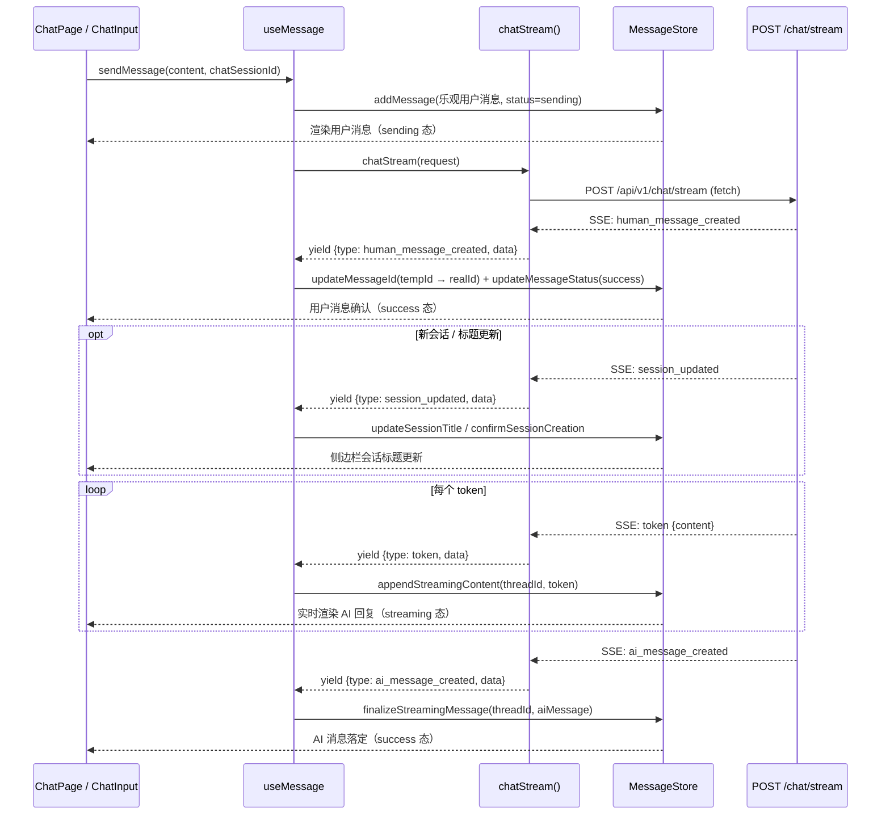

# 流式聊天前端集成技术指南

> 本文档描述前端如何对接 `POST /api/v1/chat/stream` SSE 流式接口，涵盖 API → Store → Hook → UI 四层改造方案及数据流向。

---

## 目录

- [1. 整体数据流](#1-整体数据流)
- [2. API 层改造](#2-api-层改造)
- [3. Store 层改造](#3-store-层改造)
- [4. Hook 层改造](#4-hook-层改造)
- [5. UI 层改造](#5-ui-层改造)
- [6. 新会话场景 (Orchestrator)](#6-新会话场景-orchestrator)
- [7. 文件修改清单](#7-文件修改清单)
- [8. 关键设计决策](#8-关键设计决策)

---

## 1. 整体数据流

### 1.1 架构总览

```
┌──────────────────────────────────────────────────────────────┐
│                         UI  Layer                            │
│   ChatPage  ──▶  ChatInput(onSend)  ──▶  MessageList        │
│                                           ├─ MessageItem     │
│                                           └─ (streaming)     │
└─────────────────────────┬────────────────────────────────────┘
                          │  调用 hook.sendMessage()
                          ▼
┌──────────────────────────────────────────────────────────────┐
│                        Hook  Layer                           │
│   useMessage        ──  已有会话消息发送 + 流式接收          │
│   useChatOrchestrator ──  新会话首条消息编排 + 流式接收      │
└─────────────────────────┬────────────────────────────────────┘
                          │  调用 api 函数 + 操作 store
                          ▼
┌──────────────────────────────────────────────────────────────┐
│                        Store  Layer  (Zustand)               │
│   useMessageStore   ── messagesByThread + streaming 状态     │
│   useChatSessionStore ── session 管理 + session_updated 处理 │
│   useThreadStore    ── thread 管理（不变）                   │
└──────────────────────────────────────────────────────────────┘
                          ▲
                          │  store 被 hook/UI 订阅，自动驱动渲染
                          │
┌──────────────────────────────────────────────────────────────┐
│                        API  Layer                            │
│   chatStream()      ── fetch + SSE 解析，返回 AsyncIterator  │
│   chat()            ── 保留（兼容/降级用）                   │
└──────────────────────────────────────────────────────────────┘
```

### 1.2 流式消息时序



---

## 2. API 层改造

### 2.1 新增文件 `src/api/common/chat.ts`

在现有 `chat.ts` 基础上新增流式接口函数和 SSE 事件类型。

#### 2.1.1 SSE 事件类型定义

```typescript
// src/api/common/chat.ts

/** SSE 事件类型（与后端 StreamEventType 对齐） */
export enum StreamEventType {
  HUMAN_MESSAGE_CREATED = "human_message_created",
  SESSION_UPDATED = "session_updated",
  TOKEN = "token",
  AI_MESSAGE_CREATED = "ai_message_created",
  ERROR = "error",
}

/** 各事件的 Payload 类型 */
export interface HumanMessageCreatedPayload {
  chat_session_id: number;
  thread_id: number;
  message: MessageIn;
}

export interface SessionUpdatedPayload {
  chat_session_id: number;
  title: string | null;
  reason: string; // "session_created" | "title_updated"
}

export interface AIMessageCreatedPayload {
  chat_session_id: number;
  thread_id: number;
  message: MessageIn;
}

/** 解析后的 SSE 事件联合类型 */
export type StreamEvent =
  | { type: StreamEventType.HUMAN_MESSAGE_CREATED; data: HumanMessageCreatedPayload }
  | { type: StreamEventType.SESSION_UPDATED; data: SessionUpdatedPayload }
  | { type: StreamEventType.TOKEN; data: { content: string } }
  | { type: StreamEventType.AI_MESSAGE_CREATED; data: AIMessageCreatedPayload }
  | { type: StreamEventType.ERROR; data: { code: number; message: string } };
```

#### 2.1.2 SSE 解析核心函数

```typescript
// src/api/common/chat.ts

import { API_CONFIG } from "../core/config";

/**
 * 流式聊天 API —— 使用 fetch + ReadableStream 解析 SSE
 *
 * 设计决策：不使用 EventSource，因为：
 *  1. EventSource 只支持 GET 请求，此接口为 POST
 *  2. EventSource 无法自定义 headers（如 Authorization）
 *  3. fetch 的 ReadableStream 提供更细粒度的控制（如 AbortController 取消）
 *
 * @param request  ChatRequest（复用现有类型）
 * @param signal   AbortSignal，用于外部取消流式连接
 * @returns AsyncGenerator，逐个 yield 解析后的 StreamEvent
 */
export async function* chatStream(
  request: ChatRequest,
  signal?: AbortSignal,
): AsyncGenerator<StreamEvent> {
  const response = await fetch(`${API_CONFIG.baseUrl}/chat/stream`, {
    method: "POST",
    headers: {
      "Content-Type": "application/json",
      // 如有 token，在此附加：
      // "Authorization": `Bearer ${getToken()}`,
    },
    body: JSON.stringify(request),
    signal,
    credentials: "include", // 与 apiClient 保持一致
  });

  if (!response.ok) {
    throw new Error(`Stream request failed: ${response.status}`);
  }

  const reader = response.body!.getReader();
  const decoder = new TextDecoder();
  let buffer = "";

  try {
    while (true) {
      const { done, value } = await reader.read();
      if (done) break;

      buffer += decoder.decode(value, { stream: true });

      // SSE 格式：每个事件以 \n\n 分隔
      const parts = buffer.split("\n\n");
      buffer = parts.pop() ?? ""; // 最后一段可能不完整，留在 buffer

      for (const part of parts) {
        if (!part.trim()) continue;

        let eventType = "";
        let dataStr = "";

        for (const line of part.split("\n")) {
          if (line.startsWith("event: ")) {
            eventType = line.slice(7).trim();
          } else if (line.startsWith("data: ")) {
            dataStr = line.slice(6);
          }
        }

        if (eventType && dataStr) {
          yield {
            type: eventType as StreamEventType,
            data: JSON.parse(dataStr),
          } as StreamEvent;
        }
      }
    }
  } finally {
    reader.releaseLock();
  }
}
```

#### 2.1.3 导出

```typescript
// src/api/common/index.ts — 新增导出
export {
  chatStream,
  StreamEventType,
  type StreamEvent,
  type HumanMessageCreatedPayload,
  type SessionUpdatedPayload,
  type AIMessageCreatedPayload,
} from "./chat";
```

> **注意**：原有的 `chat()` 函数保留，可用于降级或非流式场景。

---

## 3. Store 层改造

### 3.1 MessageStore 新增流式状态

在 `useMessageStore` 中新增两个关键 action，用于流式阶段的增量内容更新。

#### 3.1.1 新增 Store 接口

```typescript
// src/stores/message-store.ts — 在 MessageStore interface 中新增

export interface MessageStore {
  // ... 现有字段保持不变 ...

  /**
   * 开始流式接收：在指定 thread 尾部追加一条 streaming 占位消息
   * 该消息初始 content 为空，status 为 "streaming"
   */
  startStreaming: (threadId: string | number, placeholderMessage: Message) => void;

  /**
   * 追加流式 token 内容到指定 thread 最后一条消息
   * 仅当最后一条消息 status === "streaming" 时生效
   */
  appendStreamingContent: (threadId: string | number, token: string) => void;

  /**
   * 结束流式：用后端返回的完整 AI 消息替换 streaming 占位消息
   * 将最后一条 streaming 消息替换为 status="success" 的正式消息
   */
  finalizeStreamingMessage: (threadId: string | number, finalMessage: Message) => void;

  /**
   * 中止流式：将最后一条 streaming 消息标记为 error 或移除
   */
  abortStreaming: (threadId: string | number) => void;
}
```

#### 3.1.2 实现

```typescript
// src/stores/message-store.ts — 在 create() 内新增

startStreaming: (threadId, placeholderMessage) =>
  set((state) => ({
    messagesByThread: {
      ...state.messagesByThread,
      [threadId]: [
        ...(state.messagesByThread[threadId] ?? []),
        placeholderMessage,
      ],
    },
  })),

appendStreamingContent: (threadId, token) =>
  set((state) => {
    const messages = state.messagesByThread[threadId];
    if (!messages || messages.length === 0) return state;

    const lastMsg = messages[messages.length - 1];
    if (lastMsg.status !== "streaming") return state;

    return {
      messagesByThread: {
        ...state.messagesByThread,
        [threadId]: [
          ...messages.slice(0, -1),
          { ...lastMsg, content: lastMsg.content + token },
        ],
      },
    };
  }),

finalizeStreamingMessage: (threadId, finalMessage) =>
  set((state) => {
    const messages = state.messagesByThread[threadId];
    if (!messages || messages.length === 0) return state;

    // 替换最后一条 streaming 消息
    return {
      messagesByThread: {
        ...state.messagesByThread,
        [threadId]: [...messages.slice(0, -1), finalMessage],
      },
    };
  }),

abortStreaming: (threadId) =>
  set((state) => {
    const messages = state.messagesByThread[threadId];
    if (!messages || messages.length === 0) return state;

    const lastMsg = messages[messages.length - 1];
    if (lastMsg.status !== "streaming") return state;

    // 若已有内容，保留但标记 error；若无内容，移除
    if (lastMsg.content.trim()) {
      return {
        messagesByThread: {
          ...state.messagesByThread,
          [threadId]: [
            ...messages.slice(0, -1),
            { ...lastMsg, status: "error" as const },
          ],
        },
      };
    }
    return {
      messagesByThread: {
        ...state.messagesByThread,
        [threadId]: messages.slice(0, -1),
      },
    };
  }),
```

### 3.2 利用现有 `MessageStatus` 类型

当前 `types/message.ts` 中已定义了 `"streaming"` 状态，无需修改：

```typescript
export type MessageStatus = "sending" | "success" | "error" | "streaming";
```

### 3.3 Store 数据流总结

```
chatStream API yield event
         │
         ├── human_message_created  { chat_session_id, thread_id, message }
         │     └── updateMessageId() + updateMessageStatus("success")
         │
         ├── session_updated  { chat_session_id, title, reason }
         │     └── ChatSessionStore.updateSessionTitle()
         │         或 confirmSessionCreation()（新会话场景）
         │
         ├── token  { content }
         │     └── appendStreamingContent(threadId, token)
         │         → 修改 messagesByThread[threadId] 最后一条消息的 content
         │         → UI 订阅自动触发渲染
         │
         ├── ai_message_created  { chat_session_id, thread_id, message }
         │     └── finalizeStreamingMessage(threadId, aiMessage)
         │         → 替换 streaming 占位消息 → status 变为 "success"
         │
         └── error  { code, message }
               └── abortStreaming(threadId)
                   → 标记 error 或移除占位消息
```

---

## 4. Hook 层改造

### 4.1 `useMessage` —— 已有会话的流式发送

改造 `src/hooks/use-message.ts` 中的 `sendMessage`，从原先的"请求→等待完整响应"改为"请求→逐事件处理"。

#### 4.1.1 改造前后对比

| 步骤 | 改造前（`chat()` 接口） | 改造后（`chatStream()` 接口） |
| --- | --- | --- |
| 1. 乐观添加用户消息 | `addMessage(sending)` | `addMessage(sending)` **不变** |
| 2. 发送请求 | `await chatApi(...)` 等待完整响应 | `chatStream(...)` 启动异步迭代 |
| 3. 确认用户消息 | 一次性替换 ID + status | 收到 `human_message_created` 后从 `data.message` 中替换 |
| 3.5 会话更新 | — | 收到 `session_updated` 后更新标题 |
| 4. AI 回复 | 一次性 `addMessage(aiMsg)` | 先 `startStreaming()`，逐 token `appendStreamingContent()`，最后从 `data.message` 中 `finalizeStreamingMessage()` |

#### 4.1.2 核心实现

```typescript
// src/hooks/use-message.ts

import {
  chatStream,
  StreamEventType,
  type ChatRequest,
  type StreamEvent,
} from "@/api/common";

export function useMessage(threadId?: string | number | null) {
  const {
    addMessage,
    updateMessageId,
    updateMessageStatus,
    startStreaming,
    appendStreamingContent,
    finalizeStreamingMessage,
    abortStreaming,
    // ... 其他现有方法
  } = useMessageStore.getState();

  // ... fetchMessages 保持不变 ...

  /**
   * 发送消息（已有会话场景） —— 流式版本
   */
  const sendMessage = useCallback(
    async (content: string, chatSessionId: number) => {
      if (!threadId || typeof threadId !== "number") {
        throw new Error("Cannot send message without a real threadId");
      }

      const tempMsgId = crypto.randomUUID();
      const abortController = new AbortController();

      // 1. 乐观更新：立即显示用户消息
      addMessage(threadId, {
        id: tempMsgId,
        tempId: tempMsgId,
        role: 1,
        content,
        status: "sending",
        timestamp: new Date(),
        threadId,
      });

      try {
        // 2. 启动流式请求
        const stream = chatStream(
          { chat_session_id: chatSessionId, thread_id: threadId, content },
          abortController.signal,
        );

        for await (const event of stream) {
          switch (event.type) {
            case StreamEventType.HUMAN_MESSAGE_CREATED: {
              // 3. 用户消息已入库，从包装结构中取出 message
              const humanMsg = mapMessageInToMessage(event.data.message);
              updateMessageId(threadId, tempMsgId, Number(humanMsg.id));
              updateMessageStatus(threadId, Number(humanMsg.id), "success");
              break;
            }

            case StreamEventType.SESSION_UPDATED: {
              // 3.5 会话标题更新（已有会话场景下可能触发标题变更）
              const { chat_session_id, title } = event.data;
              if (title) {
                useChatSessionStore.getState().updateSessionTitle(chat_session_id, title);
              }
              break;
            }

            case StreamEventType.TOKEN: {
              // 4. 首个 token 到达时初始化 streaming 占位消息
              const currentMessages = useMessageStore.getState().getMessages(threadId);
              const lastMsg = currentMessages[currentMessages.length - 1];
              if (!lastMsg || lastMsg.status !== "streaming") {
                startStreaming(threadId, {
                  id: `streaming-${threadId}`,
                  role: 2,
                  content: "",
                  status: "streaming",
                  threadId,
                });
              }
              appendStreamingContent(threadId, event.data.content);
              break;
            }

            case StreamEventType.AI_MESSAGE_CREATED: {
              // 5. AI 消息入库完成，从包装结构中取出 message
              const aiMsg = mapMessageInToMessage(event.data.message);
              finalizeStreamingMessage(threadId, aiMsg);
              break;
            }

            case StreamEventType.ERROR: {
              console.error("Stream error:", event.data.message);
              abortStreaming(threadId);
              break;
            }
          }
        }
      } catch (error) {
        console.error("Failed to send message:", error);
        updateMessageStatus(threadId, tempMsgId, "error");
        abortStreaming(threadId);
      }
    },
    [threadId],
  );

  // 返回 AbortController 引用，供组件在 unmount 时取消
  return { messages, sendMessage, fetchMessages };
}
```

### 4.2 `useChatOrchestrator` —— 新会话首条消息流式版

改造 `src/pages/chat/hooks/use-chat-orchestrator.ts`。

核心区别：新会话需要先创建乐观 session，调用流式 API 时 `chat_session_id=-1, thread_id=-1`，从 `human_message_created` 事件的包装结构中获取真实 `chat_session_id` 和 `thread_id`，从 `session_updated` 事件中获取标题，再做消息迁移。

```typescript
// src/pages/chat/hooks/use-chat-orchestrator.ts

import {
  chatStream,
  StreamEventType,
} from "@/api/common";

export function useChatOrchestrator() {
  const navigate = useNavigate();
  const { createSession, confirmSessionCreation, markSessionError } = useChatSession();
  const { updateActiveThreadId } = useChatSessionStore.getState();
  const {
    addMessage,
    updateMessageId,
    updateMessageStatus,
    migrateThreadMessages,
    startStreaming,
    appendStreamingContent,
    finalizeStreamingMessage,
    abortStreaming,
  } = useMessageStore();

  const sendFirstMessage = async (content: string): Promise<string> => {
    // 1. 乐观创建 session
    const tempSessionId = createSession();
    const optimisticThreadId = -(Date.now() + Math.floor(Math.random() * 1000));
    const tempMsgId = crypto.randomUUID();

    updateActiveThreadId(tempSessionId, optimisticThreadId);

    // 2. 乐观添加用户消息
    addMessage(optimisticThreadId, {
      id: tempMsgId,
      tempId: tempMsgId,
      role: 1,
      content,
      status: "sending",
      timestamp: new Date(),
      threadId: optimisticThreadId,
    });

    try {
      // 3. 启动流式请求
      const stream = chatStream({
        chat_session_id: -1,
        thread_id: -1,
        content,
      });

      let realThreadId: number | null = null;
      let realChatSessionId: number | null = null;
      let sessionTitle: string | undefined;

      for await (const event of stream) {
        switch (event.type) {
          case StreamEventType.HUMAN_MESSAGE_CREATED: {
            // 从包装结构中提取 chat_session_id + thread_id + message
            const { chat_session_id, thread_id, message } = event.data;
            realChatSessionId = chat_session_id;
            realThreadId = thread_id;

            updateMessageId(optimisticThreadId, tempMsgId, message.id);
            updateMessageStatus(optimisticThreadId, message.id, "success");
            break;
          }

          case StreamEventType.SESSION_UPDATED: {
            // 新会话创建后收到标题等信息
            const { title } = event.data;
            if (title) {
              sessionTitle = title;
            }
            break;
          }

          case StreamEventType.TOKEN: {
            const currentMessages = useMessageStore.getState().getMessages(optimisticThreadId);
            const lastMsg = currentMessages[currentMessages.length - 1];
            if (!lastMsg || lastMsg.status !== "streaming") {
              startStreaming(optimisticThreadId, {
                id: `streaming-${optimisticThreadId}`,
                role: 2,
                content: "",
                status: "streaming",
                threadId: optimisticThreadId,
              });
            }
            appendStreamingContent(optimisticThreadId, event.data.content);
            break;
          }

          case StreamEventType.AI_MESSAGE_CREATED: {
            // 从包装结构中取出 message
            const aiMsg = mapMessageInToMessage(event.data.message);
            finalizeStreamingMessage(optimisticThreadId, aiMsg);
            break;
          }

          case StreamEventType.ERROR: {
            console.error("Stream error:", event.data.message);
            abortStreaming(optimisticThreadId);
            markSessionError(tempSessionId);
            return tempSessionId;
          }
        }
      }

      // 4. 流结束后：迁移消息、确认 session
      if (realThreadId && realChatSessionId) {
        migrateThreadMessages(optimisticThreadId, realThreadId);
        confirmSessionCreation(
          tempSessionId,
          realChatSessionId,
          realThreadId,
          sessionTitle,
        );
        navigate(`/chat/${realChatSessionId}`, { replace: true });
      }
    } catch (error) {
      console.error("Failed to create session:", error);
      updateMessageStatus(optimisticThreadId, tempMsgId, "error");
      markSessionError(tempSessionId);
    }

    return tempSessionId;
  };

  return { sendFirstMessage };
}
```

### 4.3 流式请求取消

建议在 hook 层维护 `AbortController`，供组件在以下场景取消流：

| 场景 | 处理 |
| --- | --- |
| 用户切换会话 | `useEffect` cleanup 中调用 `abort()` |
| 组件卸载 | `useEffect` cleanup 中调用 `abort()` |
| 用户手动停止生成 | UI 按钮触发 `abort()` |

```typescript
// Hook 内部维护 ref
const abortRef = useRef<AbortController | null>(null);

// 发送时创建
abortRef.current = new AbortController();
const stream = chatStream(request, abortRef.current.signal);

// 取消
const cancelStreaming = useCallback(() => {
  abortRef.current?.abort();
  if (threadId) abortStreaming(threadId);
}, [threadId]);

// useEffect cleanup
useEffect(() => {
  return () => abortRef.current?.abort();
}, [threadId]);
```

---

## 5. UI 层改造

### 5.1 MessageList —— 流式消息渲染

`MessageList` 无需大改，因为它已通过 `messages` prop 渲染所有消息。流式阶段的 streaming 消息会被 store 的 `appendStreamingContent` 持续更新，Zustand 的订阅机制自动触发组件重渲染。

需要关注的是 `MessageItem` 需识别 `status === "streaming"` 的消息，展示打字光标或 loading 指示器。

### 5.2 MessageItem —— 流式状态 UI

```tsx
// src/pages/chat/components/message-item.tsx — AI 消息区域内新增

// 在 AI 消息 content 渲染处，增加 streaming 状态判断
{message.status === "streaming" ? (
  <Box>
    <MarkdownContent content={message.content} />
    {/* 打字光标动画 */}
    <Box
      component="span"
      sx={{
        display: "inline-block",
        width: 6,
        height: 18,
        bgcolor: "text.primary",
        ml: 0.5,
        animation: "blink 1s step-end infinite",
        "@keyframes blink": {
          "0%, 100%": { opacity: 1 },
          "50%": { opacity: 0 },
        },
      }}
    />
  </Box>
) : (
  <MarkdownContent content={message.content} />
)}

// streaming 状态下隐藏操作按钮（复制、点赞等）
{message.status !== "streaming" && (
  <Box>{/* 现有操作按钮 */}</Box>
)}
```

### 5.3 ChatInput —— 发送中禁用 & 停止生成

```tsx
// src/pages/chat/components/chat-input.tsx

interface ChatInputProps {
  // ... 现有 props ...
  /** 是否正在流式生成 */
  isStreaming?: boolean;
  /** 停止生成回调 */
  onStopGeneration?: () => void;
}

// 在发送按钮区域：
{isStreaming ? (
  <IconButton onClick={onStopGeneration}>
    <StopCircle />
  </IconButton>
) : (
  <IconButton onClick={handleSend} disabled={!canSend}>
    <Send />
  </IconButton>
)}
```

### 5.4 ChatPage —— 串联流式状态

```tsx
// src/pages/chat/index.tsx

export function ChatPage() {
  // ... 现有代码 ...

  // 从 store 订阅流式状态
  const isStreaming = useMessageStore((state) => {
    if (!activeThreadId) return false;
    const msgs = state.messagesByThread[activeThreadId];
    if (!msgs || msgs.length === 0) return false;
    return msgs[msgs.length - 1].status === "streaming";
  });

  return (
    // ...
    <ChatInput
      onSend={handleSend}
      isStreaming={isStreaming}
      onStopGeneration={cancelStreaming}
      // ... 其他 props
    />
    // ...
  );
}
```

### 5.5 自动滚动

流式消息期间应自动滚动到底部，建议在消息列表容器中添加：

```tsx
const messagesEndRef = useRef<HTMLDivElement>(null);

useEffect(() => {
  if (isStreaming) {
    messagesEndRef.current?.scrollIntoView({ behavior: "smooth" });
  }
}, [messages, isStreaming]);

// 在 MessageList 容器尾部：
<div ref={messagesEndRef} />
```

---

## 6. 新会话场景 (Orchestrator)

新会话场景与已有会话的区别在于需要额外的编排逻辑，但流式处理模式一致。

### 6.1 流程对比

```
已有会话（useMessage.sendMessage）：
  乐观添加 → chatStream → 事件循环 → 结束

新会话（useChatOrchestrator.sendFirstMessage）：
  createSession(乐观) → 生成临时 threadId → 乐观添加
  → chatStream(id=-1) → 事件循环（含 session_updated 处理标题）
  → 流结束后：migrateThreadMessages → confirmSessionCreation(含title) → navigate
```

### 6.2 后端已支持的关键设计

| 问题 | 后端方案 | 前端对接方式 |
| --- | --- | --- |
| `chat_session_id` 获取 | `human_message_created` payload 包含 `chat_session_id` 字段 | 从 `event.data.chat_session_id` 直接读取 |
| 标题生成 | 新增 `session_updated` 事件，携带 `title` 和 `reason` | 从 `event.data.title` 读取，调用 `updateSessionTitle()` |
| `temp_id` 回传 | `ChatRequest` 支持 `temp_id` 字段 | 发送时携带，用于乐观更新映射（可选） |

---

## 7. 文件修改清单
a
| 文件路径 | 改动类型 | 说明 |
| --- | --- | --- |
| `src/api/common/chat.ts` | **修改** | 新增 `StreamEventType`、`StreamEvent`、`chatStream()` |
| `src/api/common/index.ts` | **修改** | 导出新增的流式类型和函数 |
| `src/stores/message-store.ts` | **修改** | 新增 `startStreaming`、`appendStreamingContent`、`finalizeStreamingMessage`、`abortStreaming` |
| `src/hooks/use-message.ts` | **修改** | `sendMessage` 改用流式接口 |
| `src/pages/chat/hooks/use-chat-orchestrator.ts` | **修改** | `sendFirstMessage` 改用流式接口 |
| `src/pages/chat/components/message-item.tsx` | **修改** | 支持 `streaming` 状态的 UI（打字光标、隐藏操作按钮） |
| `src/pages/chat/components/chat-input.tsx` | **修改** | 新增 `isStreaming`/`onStopGeneration` props |
| `src/pages/chat/index.tsx` | **修改** | 订阅 `isStreaming` 状态，传递给 `ChatInput` |
| `src/types/message.ts` | **无改动** | `MessageStatus` 已包含 `"streaming"` |

---

## 8. 关键设计决策

### 8.1 为什么用 `fetch` 而不是 `EventSource`？

| 对比项 | `EventSource` | `fetch` + `ReadableStream` |
| --- | --- | --- |
| 请求方法 | 仅 GET | ✅ 支持 POST |
| 自定义 Header | ❌ 不支持 | ✅ Authorization 等 |
| 取消请求 | `close()` | ✅ `AbortController` |
| 自动重连 | ✅ 内建 | ❌ 需手动（此场景不需要） |
| 流式控制 | ❌ 黑盒 | ✅ 细粒度控制 |

单次请求-响应的 LLM 流式场景不需要自动重连，`fetch` 方案更匹配。

### 8.2 为什么在 Store 中用"占位消息 + append"而非"替换整条消息"？

1. **性能**：每个 token 仅修改最后一条消息的 `content` 字段；若每次替换整个数组，会造成更多不必要的浅比较失败
2. **语义清晰**：`streaming` 状态的消息在 store 中有明确的生命周期（start → append → finalize）
3. **UI 友好**：组件可根据 `status === "streaming"` 精确控制渲染行为（光标、按钮隐藏等）

### 8.3 乐观更新策略不变

流式改造不影响现有的乐观更新设计：
- 用户消息仍然先以 `status: "sending"` 追加到 store
- 收到 `human_message_created` 后置为 `"success"`
- AI 消息通过 streaming → finalize 两阶段完成

### 8.4 错误恢复

| 错误阶段 | 影响 | 恢复策略 |
| --- | --- | --- |
| 请求发出前 | 用户消息已乐观添加 | 标记 `error`，可重试 |
| `human_message_created` 之前断开 | 用户消息可能已入库 | 标记 `error`，刷新页面可恢复 |
| token 阶段断开 | AI 消息不入库 | `abortStreaming`，已收到的内容可保留显示 |
| `ai_message_created` 丢失 | AI 消息已入库但前端不知道 | 标记 `error`，刷新页面可恢复 |
